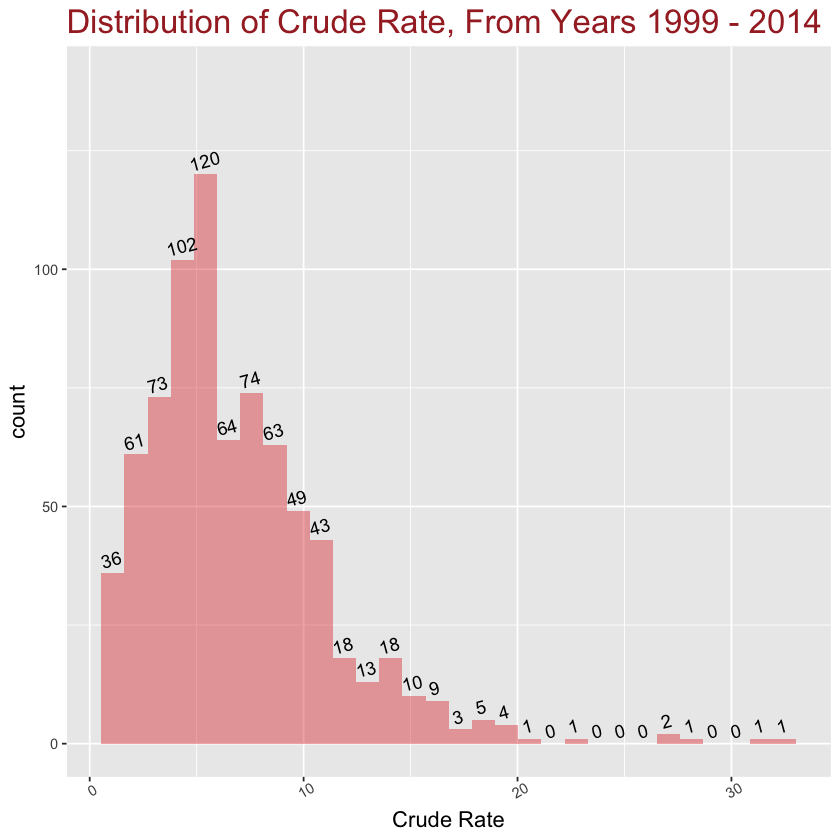
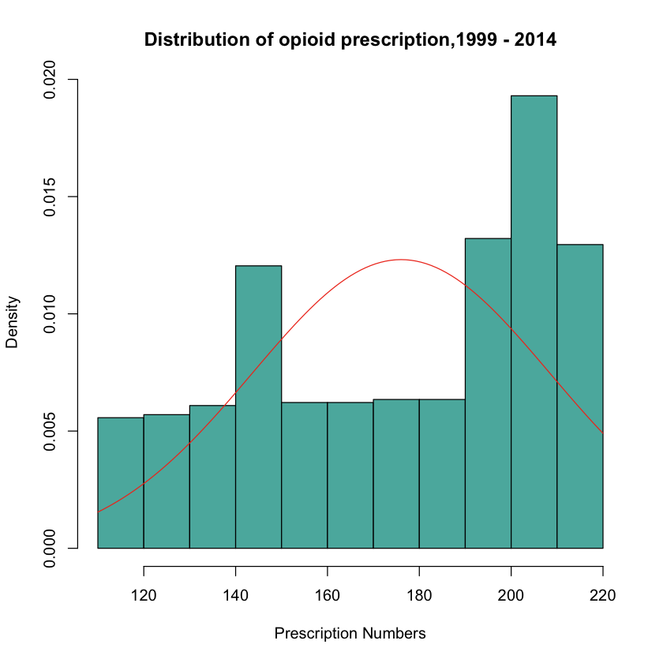
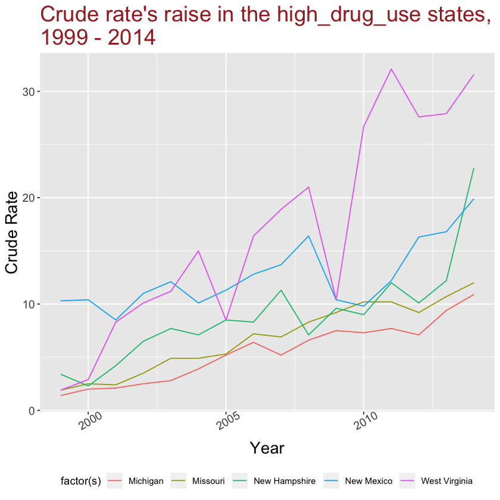
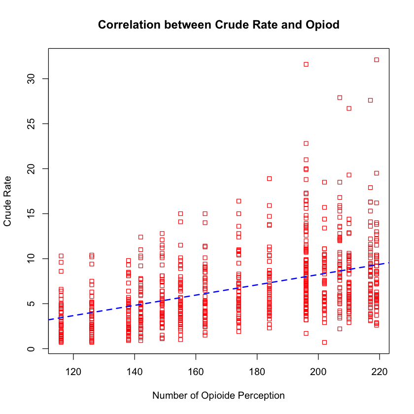
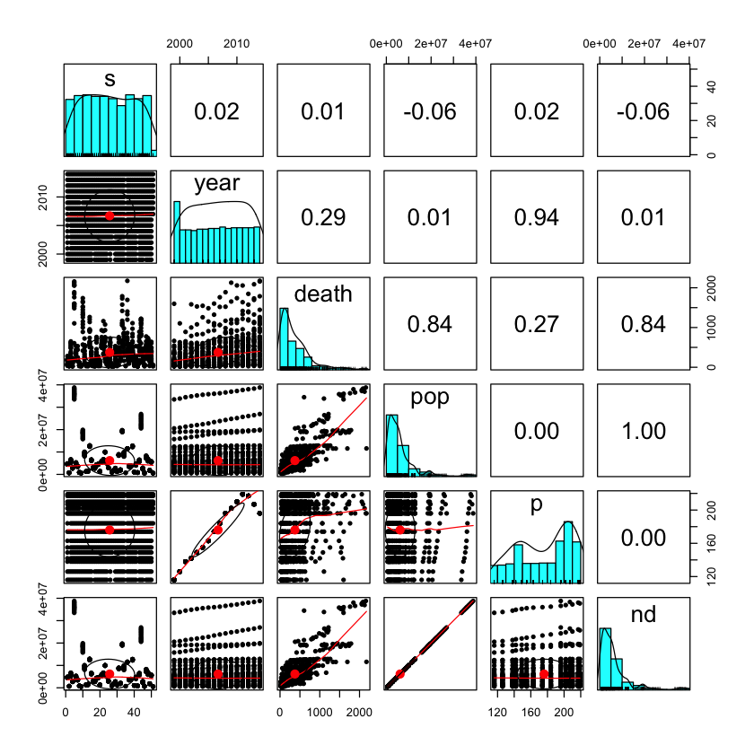
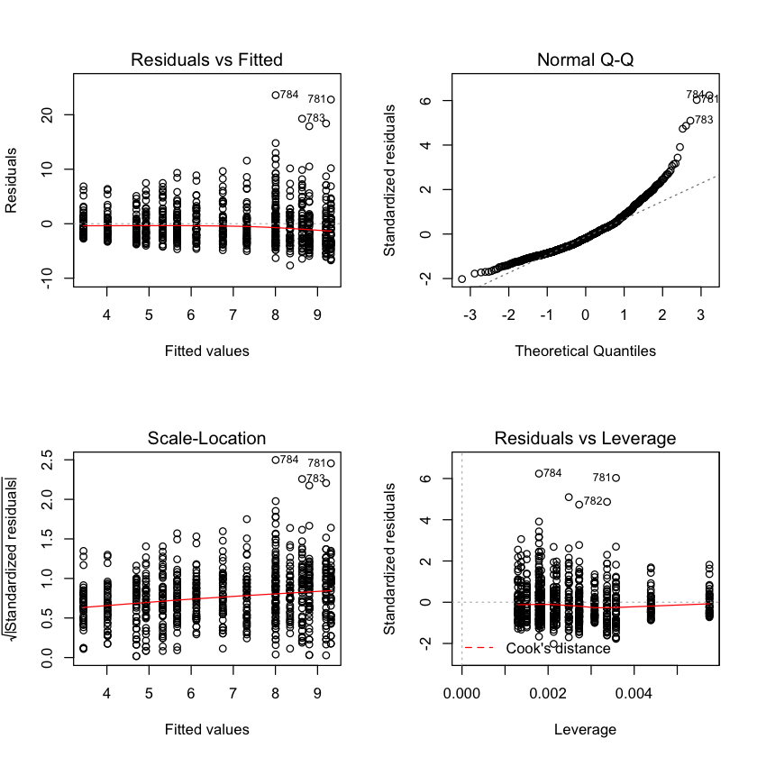
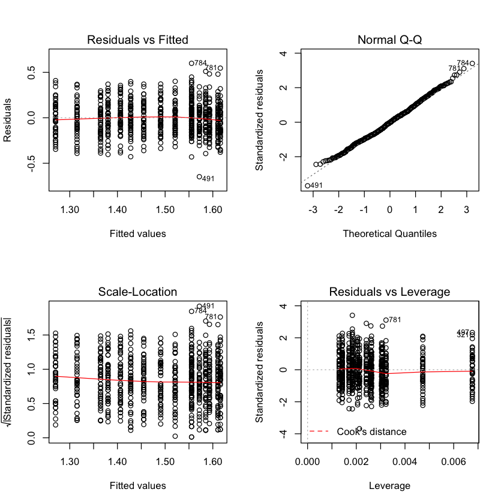

<h1>
Overdose death involving opioid perscreption</h1>
<p>
    Golnaz Abrishami <br>
    Professor Dana Nehoran<br>
    October 2018<br><p>

## Why Opioid ?

The opioid is a class of drugs that include illegal drugs heroin, synthetic opioids such as fentanyl,and pain relievers obtained by legally prescription, such as Oxycodone, hydrocodone, morphine, and many others.

According to the Center for Disease Control, the U.S is experiencing an epidemic of the drug overdose; however, the numbers of opioid prescriptions, the prescriptions that include illegal drugs, are not controlled. We have chosen a dataset to analyze the relationship between opioid prescriptions and the number of overdose death involving opioid.

## Objective

1. Can we confrim that there is an opiod epidemic in USA?
2. Are Opiod death is an issue in the USA ?


## Some related studies:

- [America Has the Highest Drug-Death Rate in North America - and the World](https://www.statista.com/chart/9973/drug-related-deaths-and-mortality-rate-worldwide/) <br>
- [Understanding the Epidemic](https://www.cdc.gov/drugoverdose/epidemic/index.html)<br>
- [Drug Overdose Deaths](https://www.cdc.gov/drugoverdose/data/statedeaths.html)<br>

### Exploring DataSet


```R
library("ggplot2")
library(dplyr)
library(psych)
library(quantmod)
library(MASS)
```


```R
OD <- read.csv("OpiodDeath.csv", head=T)
OD <- data.frame(OD)
head(OD)
```


<table>
<thead><tr><th scope=col>STt</th><th scope=col>Year</th><th scope=col>Deaths</th><th scope=col>Population</th><th scope=col>Crude.Rate</th><th scope=col>Crude.Rate.Lower.95..Confidence.Interval</th><th scope=col>Crude.Rate.Upper.95..Confidence.Interval</th><th scope=col>Prescriptions.Dispensed.by.US.Retailers.by.millions</th></tr></thead>
<tbody>
	<tr><td>Alabama</td><td>1999   </td><td>39     </td><td>4430141</td><td>0.9    </td><td>0.6    </td><td>1.2    </td><td>116    </td></tr>
	<tr><td>Alabama</td><td>2000   </td><td>46     </td><td>4447100</td><td>1.0    </td><td>0.8    </td><td>1.4    </td><td>126    </td></tr>
	<tr><td>Alabama</td><td>2001   </td><td>67     </td><td>4467634</td><td>1.5    </td><td>1.2    </td><td>1.9    </td><td>138    </td></tr>
	<tr><td>Alabama</td><td>2002   </td><td>75     </td><td>4480089</td><td>1.7    </td><td>1.3    </td><td>2.1    </td><td>142    </td></tr>
	<tr><td>Alabama</td><td>2003   </td><td>54     </td><td>4503491</td><td>1.2    </td><td>0.9    </td><td>1.6    </td><td>149    </td></tr>
	<tr><td>Alabama</td><td>2004   </td><td>92     </td><td>4530729</td><td>2.0    </td><td>1.6    </td><td>2.5    </td><td>155    </td></tr>
</tbody>
</table>


### Explenation of each column :

1. **Prescriptions.Dispensed.by.US.Retailers.by.millions** = The numbers of opioid percriptions despensed.

2. **STt** : The names of states in which the opiod perscriptions despensed.

3. **Year** : The year in which the opiod erscriptions despensed.

4. **Deaths** :  Numbers of death in specific year and state in which the opiod erscriptions despensed.

5. **Population** : The population of state on that specific year.

6. **Crude.Rate** :  Number of new cases (or deaths) occurring in a specified population per year, which is the number of cases per 100,000 population at risk.

## Data Cleaning & Wrangling

Changing the column names to make it easier to use :


```R
colnames(OD) <-c("s","year","death","pop","c","cl","cu","p")
```

Removing rows with NaN values :


```R
ODC <- OD[complete.cases(OD), ]
```


```R
ODC[is.na(ODC),]
sum(apply(ODC,2,is.nan))

```


<table>
<thead><tr><th scope=col>s</th><th scope=col>year</th><th scope=col>death</th><th scope=col>pop</th><th scope=col>c</th><th scope=col>cl</th><th scope=col>cu</th><th scope=col>p</th><th scope=col>nd</th></tr></thead>
<tbody>
</tbody>
</table>


0


For finding the population who are not effected by opiod, we subtract death from population:


```R
ODC$nd <- (ODC$pop - ODC$death)
```

Also, we normalize death,population,prescription:


```R
scaled.dat <- scale(ODC[,c(3,4,8,9)])

colMeans(scaled.dat)
apply(scaled.dat, 2, sd)
IDC_Norm<-cbind(ODC[,c(1,2,5,6,7)],scaled.dat)
head(IDC_Norm,3)
```


<dl class=dl-horizontal>
	<dt>death</dt>
		<dd>3.30192928986285e-17</dd>
	<dt>pop</dt>
		<dd>6.94383741640354e-17</dd>
	<dt>p</dt>
		<dd>-3.31125455207179e-16</dd>
	<dt>nd</dt>
		<dd>-2.71623541160721e-17</dd>
</dl>


<dl class=dl-horizontal>
	<dt>death</dt>
		<dd>1</dd>
	<dt>pop</dt>
		<dd>1</dd>
	<dt>p</dt>
		<dd>1</dd>
	<dt>nd</dt>
		<dd>1</dd>
</dl>


<table>
<thead><tr><th scope=col>s</th><th scope=col>year</th><th scope=col>c</th><th scope=col>cl</th><th scope=col>cu</th><th scope=col>death</th><th scope=col>pop</th><th scope=col>p</th><th scope=col>nd</th></tr></thead>
<tbody>
	<tr><td>Alabama   </td><td>1999      </td><td>0.9       </td><td>0.6       </td><td>1.2       </td><td>-0.8700849</td><td>-0.2597760</td><td>-1.852589 </td><td>-0.2597380</td></tr>
	<tr><td>Alabama   </td><td>2000      </td><td>1.0       </td><td>0.8       </td><td>1.4       </td><td>-0.8519236</td><td>-0.2572197</td><td>-1.543957 </td><td>-0.2571827</td></tr>
	<tr><td>Alabama   </td><td>2001      </td><td>1.5       </td><td>1.2       </td><td>1.9       </td><td>-0.7974398</td><td>-0.2541245</td><td>-1.173600 </td><td>-0.2540905</td></tr>
</tbody>
</table>


## Exploring the cleaned data


```R
summary(ODC)
```


               s            year          death              pop          
     Alabama    : 16   Min.   :1999   Min.   :  20.00   Min.   :  534876  
     Arizona    : 16   1st Qu.:2003   1st Qu.:  93.75   1st Qu.: 1842058  
     Arkansas   : 16   Median :2007   Median : 248.50   Median : 4432864  
     California : 16   Mean   :2007   Mean   : 374.36   Mean   : 6153555  
     Colorado   : 16   3rd Qu.:2011   3rd Qu.: 521.25   3rd Qu.: 6978598  
     Connecticut: 16   Max.   :2014   Max.   :2175.00   Max.   :38802500  
     (Other)    :676                                                      
           c                cl               cu               p      
     Min.   : 0.700   Min.   : 0.500   Min.   : 0.800   Min.   :116  
     1st Qu.: 4.000   1st Qu.: 3.300   1st Qu.: 4.600   1st Qu.:149  
     Median : 5.900   Median : 5.100   Median : 6.800   Median :184  
     Mean   : 6.867   Mean   : 5.978   Mean   : 7.828   Mean   :176  
     3rd Qu.: 9.000   3rd Qu.: 7.900   3rd Qu.:10.100   3rd Qu.:207  
     Max.   :32.100   Max.   :29.500   Max.   :34.700   Max.   :219  
                                                                     
           nd          
     Min.   :  534851  
     1st Qu.: 1841921  
     Median : 4432774  
     Mean   : 6153180  
     3rd Qu.: 6978045  
     Max.   :38800341  
                       


```R
lbl_plot <- ggplot(ODC,aes(x=c))
lbl_plot + geom_histogram(fill="#de2d26", alpha=0.4) +
  stat_bin(geom="text", aes(label=..count.., angle=15),
           hjust=0.4, vjust=-0.5) + 
  labs(title= "Distribution of Crude Rate, From Years 1999 - 2014",
       x = "Crude Rate") +
  theme(plot.title= element_text(size=rel(1.8), color="brown"),
        axis.title.x= element_text(size=rel(1.2)),
        axis.title.y= element_text(size=rel(1.2)),
        axis.text.x= element_text(angle=30)) +
  ylim(0,140)

```

    `stat_bin()` using `bins = 30`. Pick better value with `binwidth`.
    `stat_bin()` using `bins = 30`. Pick better value with `binwidth`.





```R
hist(ODC$p, freq=FALSE, col="#5ab4ac", main="Distribution of opioid prescription,1999 - 2014",
     xlab="Prescription Numbers")
curve(dnorm(x, mean=mean(ODC$p), 
            sd=sd(ODC$p)), add=TRUE, col="#f03b20") 

```





```R
unique(ODC$s)
```


<ol class=list-inline>
	<li>Alabama</li>
	<li>Alaska</li>
	<li>Arizona</li>
	<li>Arkansas</li>
	<li>California</li>
	<li>Colorado</li>
	<li>Connecticut</li>
	<li>Delaware</li>
	<li>District of Columbia</li>
	<li>Florida</li>
	<li>Georgia</li>
	<li>Hawaii</li>
	<li>Idaho</li>
	<li>Illinois</li>
	<li>Indiana</li>
	<li>Iowa</li>
	<li>Kansas</li>
	<li>Kentucky</li>
	<li>Louisiana</li>
	<li>Maine</li>
	<li>Maryland</li>
	<li>Massachusetts</li>
	<li>Michigan</li>
	<li>Minnesota</li>
	<li>Mississippi</li>
	<li>Missouri</li>
	<li>Montana</li>
	<li>Nebraska</li>
	<li>Nevada</li>
	<li>New Hampshire</li>
	<li>New Jersey</li>
	<li>New Mexico</li>
	<li>New York</li>
	<li>North Carolina</li>
	<li>North Dakota</li>
	<li>Ohio</li>
	<li>Oklahoma</li>
	<li>Oregon</li>
	<li>Pennsylvania</li>
	<li>Rhode Island</li>
	<li>South Carolina</li>
	<li>South Dakota</li>
	<li>Tennessee</li>
	<li>Texas</li>
	<li>Utah</li>
	<li>Vermont</li>
	<li>Virginia</li>
	<li>Washington</li>
	<li>West Virginia</li>
	<li>Wisconsin</li>
	<li>Wyoming</li>
</ol>

<details>
	<summary style=display:list-item;cursor:pointer>
		<strong>Levels</strong>:
	</summary>
	<ol class=list-inline>
		<li>'Alabama'</li>
		<li>'Alaska'</li>
		<li>'Arizona'</li>
		<li>'Arkansas'</li>
		<li>'California'</li>
		<li>'Colorado'</li>
		<li>'Connecticut'</li>
		<li>'Delaware'</li>
		<li>'District of Columbia'</li>
		<li>'Florida'</li>
		<li>'Georgia'</li>
		<li>'Hawaii'</li>
		<li>'Idaho'</li>
		<li>'Illinois'</li>
		<li>'Indiana'</li>
		<li>'Iowa'</li>
		<li>'Kansas'</li>
		<li>'Kentucky'</li>
		<li>'Louisiana'</li>
		<li>'Maine'</li>
		<li>'Maryland'</li>
		<li>'Massachusetts'</li>
		<li>'Michigan'</li>
		<li>'Minnesota'</li>
		<li>'Mississippi'</li>
		<li>'Missouri'</li>
		<li>'Montana'</li>
		<li>'Nebraska'</li>
		<li>'Nevada'</li>
		<li>'New Hampshire'</li>
		<li>'New Jersey'</li>
		<li>'New Mexico'</li>
		<li>'New York'</li>
		<li>'North Carolina'</li>
		<li>'North Dakota'</li>
		<li>'Ohio'</li>
		<li>'Oklahoma'</li>
		<li>'Oregon'</li>
		<li>'Pennsylvania'</li>
		<li>'Rhode Island'</li>
		<li>'South Carolina'</li>
		<li>'South Dakota'</li>
		<li>'Tennessee'</li>
		<li>'Texas'</li>
		<li>'Utah'</li>
		<li>'Vermont'</li>
		<li>'Virginia'</li>
		<li>'Washington'</li>
		<li>'West Virginia'</li>
		<li>'Wisconsin'</li>
		<li>'Wyoming'</li>
	</ol>
</details>


```R
high_drug=ODC[ODC$s %in% c('Missouri','New Hampshire','New Mexico','Michigan','West Virginia'),] 
head(high_drug,3)
```


<table>
<thead><tr><th></th><th scope=col>s</th><th scope=col>year</th><th scope=col>death</th><th scope=col>pop</th><th scope=col>c</th><th scope=col>cl</th><th scope=col>cu</th><th scope=col>p</th><th scope=col>nd</th></tr></thead>
<tbody>
	<tr><th scope=row>353</th><td>Michigan</td><td>1999    </td><td>140     </td><td>9897116 </td><td>1.4     </td><td>1.2     </td><td>1.6     </td><td>116     </td><td>9896976 </td></tr>
	<tr><th scope=row>354</th><td>Michigan</td><td>2000    </td><td>196     </td><td>9938444 </td><td>2.0     </td><td>1.7     </td><td>2.2     </td><td>126     </td><td>9938248 </td></tr>
	<tr><th scope=row>355</th><td>Michigan</td><td>2001    </td><td>211     </td><td>9991120 </td><td>2.1     </td><td>1.8     </td><td>2.4     </td><td>138     </td><td>9990909 </td></tr>
</tbody>
</table>


```R
theme_improve <- function(my_plot, title_color= 'brown',
                           title_size= 2, axis_title_size=1.5,
                           axis_text_size=1.3,
                           x_axis_text_angle=30) {
  my_plot = my_plot +
  theme(plot.title = element_text(size = rel(title_size),
                                  color = title_color),
        axis.title.y = element_text(size = rel(axis_title_size)),
        axis.title.x = element_text(size = rel(axis_title_size)),
        axis.text.x = element_text(size = rel(axis_text_size),
                                   angle = x_axis_text_angle),
        axis.text.y = element_text(size = rel(axis_text_size))
        )
  return(my_plot)
}

```


```R
my_plt <- ggplot(high_drug, aes(x=year, y=c))
(my_plt +
  geom_line(aes(color = factor(s))) +
  labs(y='Crude Rate',x="Year",
       fill='states',
       title="Crude rate's raise in the high_drug_use states,\n1999 - 2014") +
  theme(legend.position='bottom'))%>%
theme_improve
```





```R
which (ODC$s=="West Virginia")

ind5
ODC$year[ind1]
```


<ol class=list-inline>
	<li>733</li>
	<li>734</li>
	<li>735</li>
	<li>736</li>
	<li>737</li>
	<li>738</li>
	<li>739</li>
	<li>740</li>
	<li>741</li>
	<li>742</li>
	<li>743</li>
	<li>744</li>
	<li>745</li>
	<li>746</li>
	<li>747</li>
	<li>748</li>
</ol>


<ol class=list-inline>
	<li>733</li>
	<li>734</li>
	<li>735</li>
	<li>736</li>
	<li>737</li>
	<li>738</li>
	<li>739</li>
	<li>740</li>
	<li>741</li>
	<li>742</li>
	<li>743</li>
	<li>744</li>
	<li>745</li>
	<li>746</li>
	<li>747</li>
	<li>748</li>
</ol>


<ol class=list-inline>
	<li>1999</li>
	<li>2000</li>
	<li>2001</li>
	<li>2002</li>
	<li>2003</li>
	<li>2004</li>
	<li>2005</li>
	<li>2006</li>
	<li>2007</li>
	<li>2008</li>
	<li>2009</li>
	<li>2010</li>
	<li>2011</li>
	<li>2012</li>
	<li>2013</li>
	<li>2014</li>
</ol>


```R
ODC_plt <- ggplot(ODC, aes(factor(p),c, fill=p))
ODC_plt +  geom_boxplot(width = 0.3, lwd = 1.3, outlier.size = 3) +
  geom_violin(alpha = 0.4) +
labs(title="Do Opioid Prescriptions Raise the Crude Rate?",
       y="Crude Rate",
       x="Number of Opioid Prescriptions",
    fill="Prescriptions") +
  theme(plot.title= element_text(size=rel(1.8), color="darkblue"),
        axis.title.x= element_text(size=rel(1.4)),
        axis.title.y= element_text(size=rel(1.6)),
        axis.text.y= element_text(angle=30, size = rel(2))) 

```


```R
ODC_ch <- ODC %>% 
group_by(s) %>%
    summarize(nd=median(nd))
```


```R
head(ODC_ch)
```


<table>
<thead><tr><th scope=col>s</th><th scope=col>nd</th></tr></thead>
<tbody>
	<tr><td>Alabama   </td><td> 4650757.5</td></tr>
	<tr><td>Alaska    </td><td>  704480.5</td></tr>
	<tr><td>Arizona   </td><td> 6097926.5</td></tr>
	<tr><td>Arkansas  </td><td> 2835053.0</td></tr>
	<tr><td>California</td><td>36134074.5</td></tr>
	<tr><td>Colorado  </td><td> 4761793.0</td></tr>
</tbody>
</table>


We have increase in both number of opioide perscreptions, and crude rate of death. It shows the relationship betweenthat between this two factors.

## Creating Linear Model

We select the avrage numbers of crude rate,which is the avarge numbers of crude rate and it's maximum and minimum, as our response variable, because we want to analyize wether opiod and other factors effect it or not. Also we did not consider states because the maximum number of opiod released in each states is equal each year.


```R
reg <- lm(c ~.-s,data=ODC)
summary(reg)
```


    
    Call:
    lm(formula = c ~ . - s, data = ODC)
    
    Residuals:
          Min        1Q    Median        3Q       Max 
    -0.168386 -0.036088 -0.002891  0.034187  0.182077 
    
    Coefficients: (1 not defined because of singularities)
                  Estimate Std. Error t value Pr(>|t|)    
    (Intercept)  1.382e+00  2.382e+00   0.580    0.562    
    year        -7.076e-04  1.200e-03  -0.589    0.556    
    death       -1.213e-04  1.345e-05  -9.021  < 2e-16 ***
    pop          3.797e-09  6.924e-10   5.483 5.67e-08 ***
    cl           5.878e-01  2.745e-03 214.163  < 2e-16 ***
    cu           4.304e-01  2.223e-03 193.605  < 2e-16 ***
    p            2.496e-04  1.649e-04   1.514    0.131    
    nd                  NA         NA      NA       NA    
    ---
    Signif. codes:  0 ‘***’ 0.001 ‘**’ 0.01 ‘*’ 0.05 ‘.’ 0.1 ‘ ’ 1
    
    Residual standard error: 0.04857 on 765 degrees of freedom
    Multiple R-squared:  0.9999,	Adjusted R-squared:  0.9999 
    F-statistic: 9.656e+05 on 6 and 765 DF,  p-value: < 2.2e-16


<b><font color="blue", size = 4>b)</font> Explore Correlations</b>: Create plots that explain the correlation between your variables, specifically concentrating on your exploratory variable

<span style="background-color: #FFFF00">Your answer here</span>


```R
plot(ODC$c ~ ODC$p,
     main="Correlation between Crude Rate and Opiod",
    xlab="Number of Opioide Perception",
    ylab="Crude Rate",pch=22,col="red")

mod1 = lm(formula = c ~ p, data = ODC)
abline(mod1, col = 'blue', lwd = 2, lty="dashed")

```





```R
pairs.panels(ODC[-c(5,6,7,10)])
```





```R
reg = lm(formula = c ~ p, data = ODC)
plot.new()
par(mfrow = c(2, 2))
plot(reg)
par(mfrow = c(1, 1))
```





We transfer our model by using optimal lamda, and logarithm.


```R
trans = boxcox(reg)
trans_df = as.data.frame(trans)
optimal_lambda = trans_df[which.max(trans$y),1]
print(optimal_lambda)
reg = lm(formula = c^optimal_lambda ~ log(p), data = ODC)
plot.new()
par(mfrow = c(2, 2))
plot(reg)
par(mfrow = c(1, 1))
```

    [1] 0.2222222





## Summary

Data shows the crude rate of opioid overdose, however, the impact is much more than what we are seeing in this research. There are numbers of passions who become addicted to opioid and reach their opioid drugs from other resources other than legal prescriptions.

Also, We have selected our data from different states with different populations during different years. We had to clean data to obtain a clear view through the facts.
